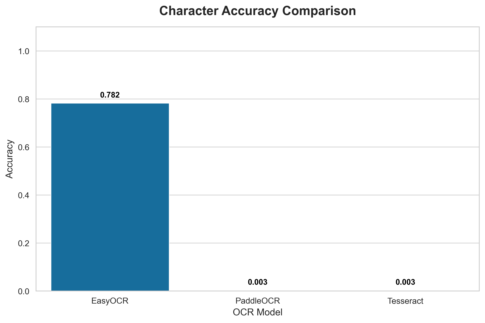
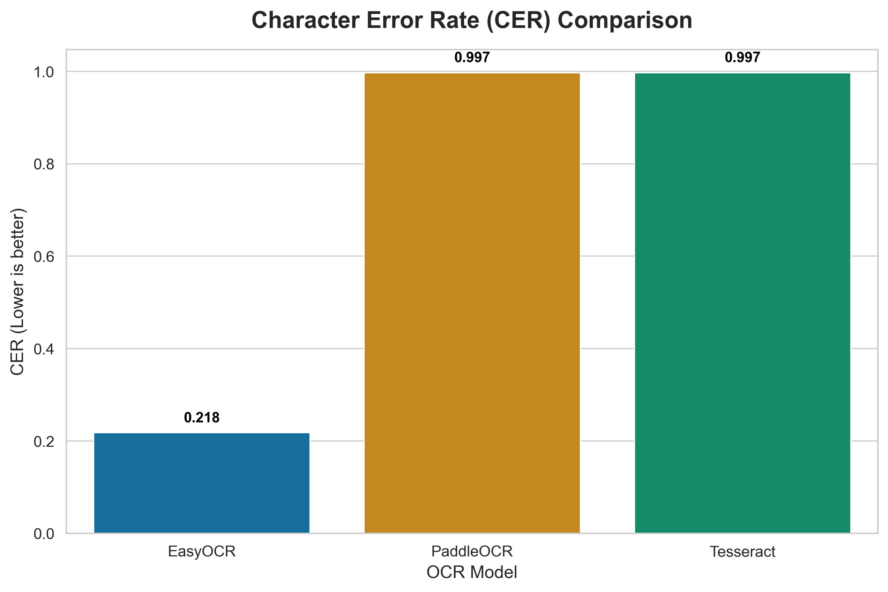
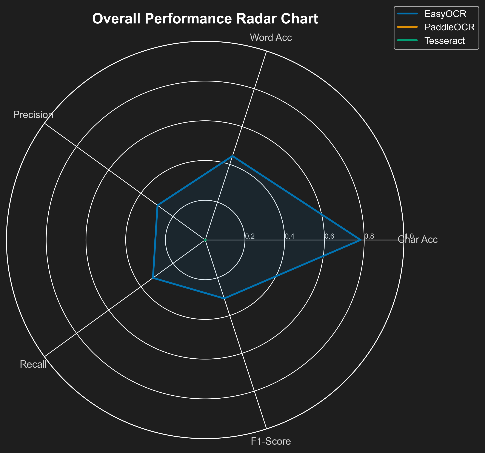
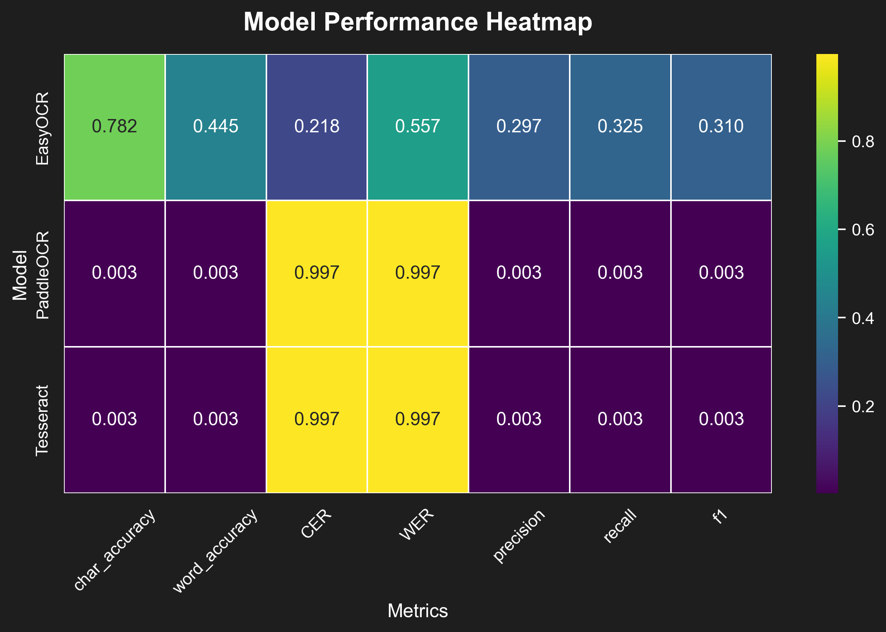
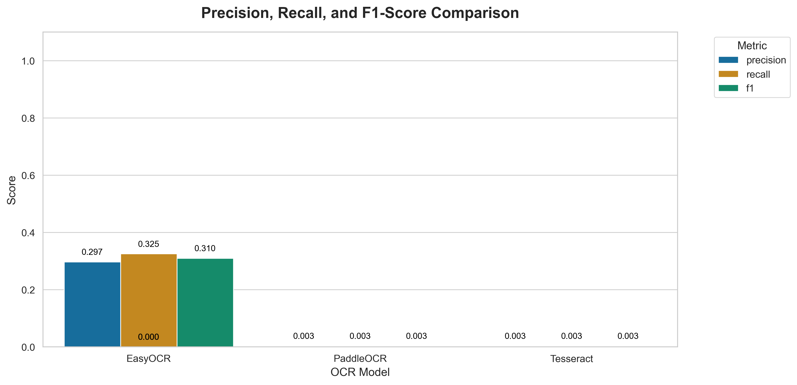
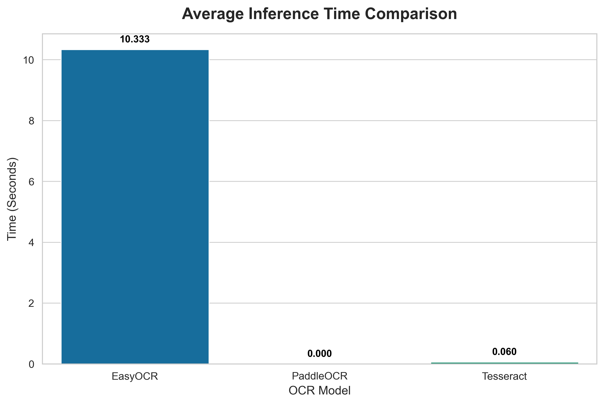

# OCR Benchmarking Pipeline for SROIE2019

A professional-grade OCR benchmarking pipeline designed to evaluate and compare multiple popular Optical Character Recognition (OCR) models on the SROIE2019 dataset. This modular system handles dataset parsing, image-to-text normalization, metric calculation, and generates visual comparative analytics.

## Supported OCR Models

*   **Tesseract** (`pytesseract`)
*   **EasyOCR**
*   **PaddleOCR**
*   *KerasOCR* (Included but disabled by default)

## Features

*   **Modular Architecture:** Easy to add new OCR models or evaluation metrics.
*   **Automated Evaluation:** Calculates comprehensive metrics including CER, WER, F1-Score, and inference time.
*   **Text Normalization:** Preprocesses both Ground Truth and Predicted texts to ensure fair comparisons.
*   **Analytics & Visualization:** Automatically generates comprehensive CSV reports and comparison plots (e.g., bar charts for accuracy and inference time).

## Benchmark Results and Discussion

Based on the comprehensive OCR benchmarking over the SROIE 2019 dataset, the following key insights were observed:

- Model **EasyOCR** achieved the highest Character Accuracy at 78.22% and Word Accuracy at 44.45%.
- Model **EasyOCR** produced the highest F1-score (0.310), indicating the best balance between precision and recall.
- Models **PaddleOCR** and **Tesseract** achieved exceptionally low scores (<5%), suggesting missing underlying dependencies (like Tesseract binaries) or models failing to initialize properly in this local environment.

The Accuracy metrics (Character and Word Accuracy) measure exact match rates, while Error Rates (CER and WER) quantify the edit distance needed to correct the predicted text. Precision, Recall, and F1-score are calculated using a Bag-of-Words approach to measure the engines' ability to retrieve the correct vocabulary regardless of ordering. 

### Visualizations

The pipeline automatically generates high-quality light and dark theme visualizations. Here are the core results from the benchmark:

#### Accuracy and Error Rates
<p align="center">
  
  
</p>

#### Multi-dimensional Performance
<p align="center">
  
  
</p>

#### Precision, Recall, F1 and Speed
<p align="center">
  
  
</p>

*For the full PDF report and LaTeX tables, please refer to the `results/exports/` and `results/tables/` directories.*

## Project Structure

```
ocr_benchmark/
├── benchmark.py           # Main entry point to run the pipeline
├── requirements.txt       # Python dependencies
├── models/                # Model wrapper implementations
│   ├── easyocr_model.py
│   ├── tesseract_model.py
│   ├── paddleocr_model.py
│   └── kerasocr_model.py
├── utils/                 # Helper utilities
│   ├── parser.py          # SROIE dataset parsing logic
│   ├── preprocessing.py   # Text normalization rules
│   ├── metrics.py         # CER, WER, F1, etc. calculation logic
│   └── visualization.py   # Plot generation
└── results/               # Generated reports and plots (created on run)
    ├── benchmark_results.csv
    ├── benchmark_summary.csv
    └── plots/
```

## Prerequisites & Setup

1.  **Python Version:** Python 3.8+ is recommended.
2.  **Tesseract System Dependency:** Ensure the Tesseract-OCR engine is installed on your system.
    *   Windows: Download from UB-Mannheim or use `winget install tesseract`.
    *   Linux: `sudo apt-get install tesseract-ocr`
3.  **Install Python Dependencies:**
    ```bash
    pip install -r requirements.txt
    ```

## Usage

1.  Ensure you have downloaded the SROIE2019 dataset.
2.  Update the `dataset_path` variable inside `benchmark.py` if your dataset is located elsewhere (currently defaults to `c:\Users\himan\Downloads\archive (1)\SROIE2019`).
3.  Run the benchmark script:

    ```bash
    python benchmark.py
    ```

4.  Once the run completes, check the `results/` folder for `benchmark_summary.csv` and the generated visual plots under `results/plots/`.

## Evaluation Metrics

The pipeline calculates the following metrics for each model per image, as well as an average summary:
*   **Character Accuracy**
*   **Word Accuracy**
*   **CER (Character Error Rate):** Lower is better.
*   **WER (Word Error Rate):** Lower is better.
*   **Precision, Recall, F1-Score:** Word-level matching metrics.
*   **Inference Time:** Average time taken to process an image.
